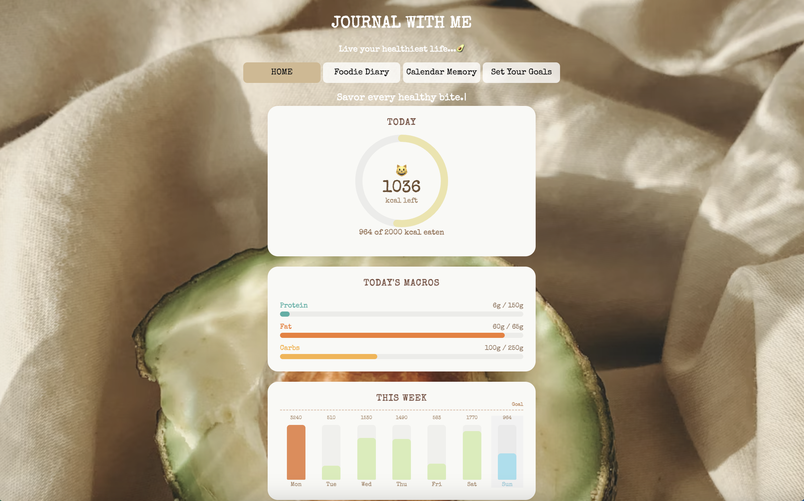
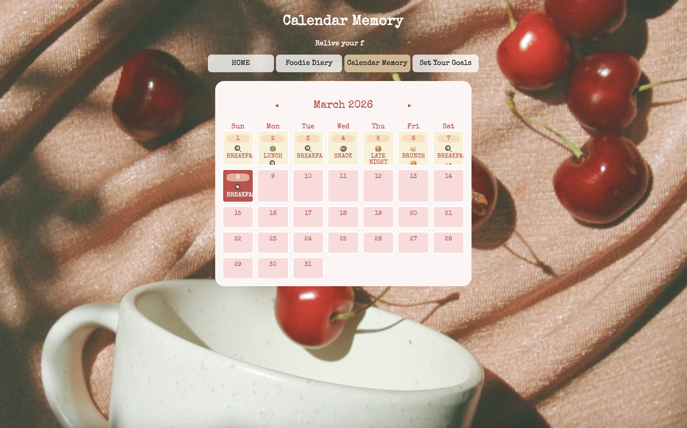
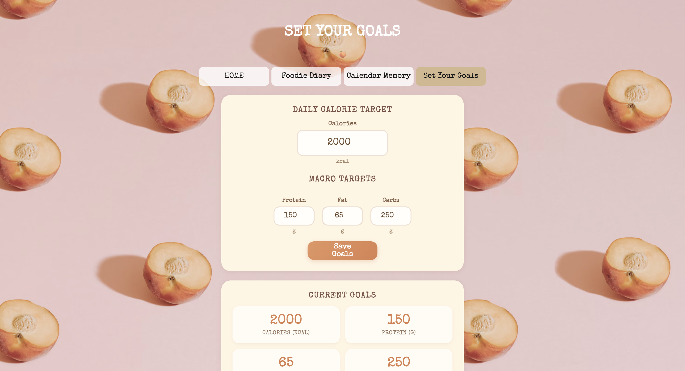

# Foodie Diary — Journal With Me

A personal food diary and nutrition tracking web app powered by AI. Upload a photo of your meal and let Google Gemini analyze its macronutrients automatically, or log entries manually. Track daily calories, set macro goals, and review your eating history on an interactive calendar.

## Demo : [Journal With Me](https://foodiediary.vercel.app/)

### Screenshots

**Home Dashboard**



**Foodie Diary**


**Calendar Memory**



**Set Your Goals**



## Features

- **AI-Powered Meal Analysis** — Upload a photo of your food and Google Gemini estimates protein, fat, carbs, and composition automatically.
- **Food Diary** — Log meals with name, meal type (breakfast, lunch, dinner, etc.), location, date, and macronutrient breakdown.
- **Dashboard** — View a calorie ring showing daily remaining calories, macro progress bars, and a weekly bar chart of calorie intake.
- **Calendar View** — Browse food entries by date on a monthly calendar. Click any day to view, edit, or delete recorded meals.
- **Goal Setting** — Set personalized daily calorie and macronutrient (protein, fat, carbs) targets.
- **Local Persistence** — All data is stored in the browser's localStorage — no account required.

## Tech Stack

| Layer         | Technology                                                                |
| ------------- | ------------------------------------------------------------------------- |
| Frontend      | React 19, TypeScript, Vite                                                |
| Styling       | Custom CSS, Material UI                                                   |
| Routing       | React Router v7                                                           |
| AI Backend    | Google Gemini API (gemini-3-flash-preview) via Vercel Serverless Function |
| Date Handling | date-fns                                                                  |
| Deployment    | Vercel                                                                    |

### Other Libraries

- `react-datepicker` — date selection in the diary form
- `typewriter-effect` — animated subtitle text on each page
- `uuid` — unique IDs for food entries
- `clsx` — conditional CSS class names

## Project Structure

```
my-eating-diary/
├── api/
│   └── server.js            # Vercel serverless function (Gemini AI endpoint)
├── public/
│   └── tabby-cat-eating-pizza.png
├── src/
│   ├── components/
│   │   ├── HomePage.tsx      # Dashboard with calorie ring, macros, weekly chart
│   │   ├── DiaryPage.tsx     # Food entry form with AI image upload
│   │   ├── CalendarPage.tsx  # Monthly calendar with meal history modal
│   │   ├── PlanPage.tsx      # Daily calorie & macro goal settings
│   │   └── LayoutPage.tsx    # Shared layout with navigation
│   ├── App.tsx               # Root component with routes and state
│   ├── type.ts               # TypeScript type definitions
│   ├── main.tsx              # Entry point
│   ├── App.css               # Global styles
│   ├── index.css             # Base styles
│   └── HomePage.css          # Dashboard-specific styles
├── index.html
├── vercel.json               # Vercel SPA rewrite config
├── vite.config.ts
├── package.json
└── tsconfig.json
```

## Getting Started

### Prerequisites

- Node.js 18+
- A [Google Gemini API key](https://ai.google.dev/)

### Installation

```bash
git clone https://github.com/Yingyingcheng/Foodie-Diary
cd my-eating-diary
npm install
```

### Environment Variables

Create a `.env` file in the project root (for Vercel deployment, add this as an environment variable in your Vercel dashboard):

```
GEMINI_API_KEY=your_google_gemini_api_key
```

### Development

```bash
npm run dev
```

The app runs at `http://localhost:5173` by default.

> **Note:** The AI image analysis feature requires the serverless function at `/api/server`, which runs on Vercel. For local development, you can use `vercel dev` to emulate the serverless environment.

### Build

```bash
npm run build
```

### Deployment

The app is configured for [Vercel](https://vercel.com). Push to your connected repository or run:

```bash
vercel --prod
```

Make sure `GEMINI_API_KEY` is set in your Vercel project's environment variables.

## Pages

### Home (`/`)

The dashboard shows today's calorie ring (remaining vs. goal), macro progress bars for protein/fat/carbs, and a 7-day weekly calorie chart. Click any day in the chart to view that day's stats.

### Foodie Diary (`/diary`)

A form to log food entries. Select a date, meal type, and location, then describe what you ate. Upload a meal photo to have Gemini AI auto-fill protein, fat, and carbs. Calories are calculated automatically (protein x 4 + carbs x 4 + fat x 9).

### Calendar Memory (`/calendar`)

A full monthly calendar. Days with logged meals display meal-type emojis. Click a date to open a modal showing all entries for that day with nutritional details, plus edit and delete actions.

### Set Your Goals (`/plan`)

Configure your daily calorie target and macro goals for protein, fat, and carbs. Goals are saved to localStorage and reflected across the dashboard and calendar.

## License

This project is for personal/portfolio use.
